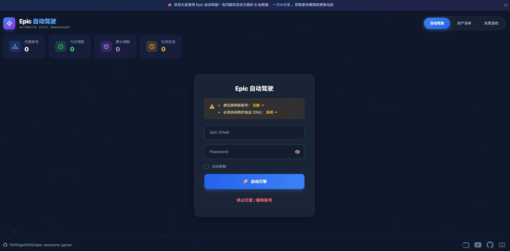

# 🎮 Epic Kiosk - 自动驾驶领取系统


**Epic Kiosk** 是一个基于 Docker 的全自动 Epic Games 免费游戏领取工具。支持多账号托管、智能验证码识别、错峰调度，一键部署即可使用。

> 🌐 **公益站点**：[https://epic.910501.xyz/](https://epic.910501.xyz/) - 免费体验，无需自建

<p align="center">
  
</p>

---

## ✨ 核心功能

| 功能 | 说明 |
|------|------|
| 🚀 **自动驾驶** | 一键启动，自动完成登录、验证码、游戏领取 |
| 🔐 **Cookie 托管** | 首次登录后保存 Cookie，后续无需重复登录 |
| 🤖 **AI 验证码** | 使用 Qwen 视觉模型智能识别 hCaptcha |
| 🚦 **错峰调度** | 智能随机延迟，避免多账号同时触发风控 |
| 🛡️ **防滥用保护** | IP 限流 + 恶意账号检测 |
| 🐳 **一键部署** | Docker Compose 部署，支持 x86/ARM |

---

## 🚀 快速开始

### 方式一：Linux 一键部署（推荐）

适用于：云服务器、VPS、Linux 主机

```bash
curl -fsSL https://raw.githubusercontent.com/10000ge10000/epic-awesome-gamer/Epic-Autopilot/install.sh | bash
```

**脚本功能**：
- ✅ 自动检测系统架构（x86_64 / ARM64）
- ✅ 自动安装 Docker 和 Docker Compose
- ✅ 交互式引导获取 API Key
- ✅ 自动克隆项目并启动服务

---

### 方式二：NAS 一键部署

适用于：群晖、威联通、绿联、飞牛等 NAS 系统

#### 📋 部署步骤

**1. 准备 API Key**

访问 [SiliconFlow 邀请链接](https://cloud.siliconflow.cn/i/OVI2n57p)：
- 注册并完成实名认证
- 创建 API Key（以 `sk-` 开头）
- 双方各得 ¥16 代金券

**2. 创建项目目录**

在 NAS 中创建一个文件夹，例如 `/docker/epic-kiosk`

**3. 创建 docker-compose.yml**

在该文件夹中创建 `docker-compose.yml` 文件，内容如下：

```yaml
# ============================================================
# Epic Kiosk - NAS 专用部署配置
# 兼容: 群晖、威联通、绿联、飞牛等 NAS 系统
# ============================================================

services:
  # Redis: 消息队列
  redis:
    image: redis:alpine
    container_name: epic-redis
    restart: always
    volumes:
      - ./data/redis:/data
    healthcheck:
      test: ["CMD", "redis-cli", "ping"]
      interval: 30s
      timeout: 10s
      retries: 3

  # Web: 前端服务（GitHub Actions 自动构建）
  web:
    image: ghcr.io/10000ge10000/epic-awesome-gamer-web:latest
    container_name: epic-web
    ports:
      - "18000:8000"
    volumes:
      - ./data:/app/data
    environment:
      - REDIS_HOST=redis
      - TZ=Asia/Shanghai
    depends_on:
      redis:
        condition: service_healthy
    restart: always

  # Worker: 后台任务执行器（GitHub Actions 自动构建）
  worker:
    image: ghcr.io/10000ge10000/epic-awesome-gamer-worker:latest
    container_name: epic-worker
    user: root
    volumes:
      - ./data:/app/data
      - ./data:/app/app/volumes
    environment:
      - REDIS_HOST=redis
      - TZ=Asia/Shanghai
      - PYTHONUNBUFFERED=1
      - ENABLE_APSCHEDULER=false
      - API_PROVIDER=siliconflow
      - SILICONFLOW_BASE_URL=https://api.siliconflow.cn/v1
      # ⚠️ 必须修改下方 API Key
      - SILICONFLOW_API_KEY=sk-xxxxxxxxxxxxxxxxxxxxxxxxxxxxxxxx
      # 模型配置（无需修改）
      - CAPTCHA_MODEL=Qwen/Qwen2.5-VL-32B-Instruct
      - CAPTCHA_MODEL_FALLBACK=Qwen/Qwen2.5-VL-72B-Instruct
      - PRIMARY_MODEL=Qwen/Qwen2.5-7B-Instruct
      - PRIMARY_MODEL_FALLBACK=Qwen/Qwen2.5-72B-Instruct
    depends_on:
      redis:
        condition: service_healthy
    restart: always
```

**4. 修改 API Key**

将 `SILICONFLOW_API_KEY=sk-xxxxxxxxxxxxxxxxxxxxxxxxxxxxxxxx` 替换为你的 API Key

**5. 启动服务**

- **群晖**：打开 Container Manager → 项目 → 新建 → 选择文件夹 → 完成
- **威联通**：打开 Container Station → 创建 → 上传 YAML 文件
- **绿联**：打开 Docker → 项目 → 创建项目 → 粘贴 YAML
- **飞牛**：打开 Docker → Compose → 新建 → 粘贴 YAML

**6. 访问控制台**

打开浏览器：`http://NAS的IP:18000`

---

### 方式三：手动部署

适用于：Windows、MacOS、Linux

**前置要求**：
- Docker & Docker Compose
- [SiliconFlow API Key](https://cloud.siliconflow.cn/i/OVI2n57p)（注册送 ¥16 代金券）

```bash
# 1. 克隆项目
git clone -b Epic-Autopilot https://github.com/10000ge10000/epic-awesome-gamer.git
cd epic-awesome-gamer

# 2. 配置 API Key
# 编辑 docker-compose.yml，替换 SILICONFLOW_API_KEY

# 3. 启动服务
docker compose up -d

# 4. 访问控制台
# http://服务器IP:18000
```

---

## 📖 使用说明

### 添加账号
1. 输入 Epic 邮箱和密码
2. 点击「启动引擎」
3. 系统自动处理登录和验证码

### 查看资产
- 点击「资产清单」Tab 查看已领取游戏
- 点击游戏封面跳转 Epic 商店

### 删除账号
- 输入密码后点击红色删除按钮
- 系统将彻底清除数据库和本地数据

---

## ⚙️ 配置说明

### 🤖 AI 模型配置（已优化）

| 类型 | 主模型 | 备用模型 | 用途 |
|------|--------|----------|------|
| 验证码 | Qwen2.5-VL-32B-Instruct | Qwen2.5-VL-72B-Instruct | hCaptcha 图像识别 |
| 主力 | Qwen2.5-7B-Instruct（免费） | Qwen2.5-72B-Instruct | 文本任务 |

**自动切换**：主模型失败时自动切换备用模型

### 💰 费用估算

- 验证码模型：¥0.5/百万 tokens
- 主力模型：**免费**
- ¥16 代金券 ≈ **1500+ 次领取任务**

---

## 📁 项目结构

```
epic-kiosk/
├── app/                    # 核心代码
│   ├── main.py             # FastAPI 后端
│   ├── worker.py           # 任务调度器
│   ├── deploy.py           # 浏览器自动化
│   └── services/           # 业务逻辑
├── templates/              # 前端页面
├── data/                   # 持久化数据
│   ├── images/             # 游戏海报
│   ├── user_data/          # 用户 Cookie
│   └── logs/               # 日志文件
├── docker-compose.yml      # 容器编排
├── install.sh              # 一键部署脚本
└── Dockerfile.worker       # Worker 镜像
```

---

## 🔒 安全机制

### IP 保护
- 1 分钟内最多 3 次请求
- 超限后临时封禁 1 小时
- 同一 IP 提交 >5 个不同账号 → 永久封禁

### 账号保护
- 同一邮箱任务互斥
- 已存储账号需验证密码
- 自动清理浏览器缓存（~2MB/账号）

---

## 🐛 故障排查

### 常见问题

**Q: 按钮显示「Requires Base Game」？**
A: 该游戏需要先拥有基础游戏，属于 DLC，跳过即可。

**Q: 验证码一直失败？**
A: 检查 API Key 是否正确，余额是否充足。

**Q: 日志显示「游戏已在库中」？**
A: 该账号已领取过此游戏，正常现象。

### 查看日志

```bash
# Worker 日志
docker logs epic-worker --tail 50

# 运行时日志文件
cat data/logs/runtime.log | tail -50
```

---

## 📚 相关文档

- [API Key 获取指南](docs/API_KEY_GUIDE.md) - SiliconFlow 注册教程
- [快速开始指南](docs/QUICKSTART.md) - 详细部署步骤
- [模型配置说明](docs/MODEL_CONFIG.md) - 模型架构说明

---

## 🤝 致谢

- 原项目：[QIN2DIM/epic-awesome-gamer](https://github.com/QIN2DIM/epic-awesome-gamer)
- AI 服务：[SiliconFlow](https://cloud.siliconflow.cn/i/OVI2n57p)

---

## ⚠️ 免责声明

本项目仅供学习和技术研究使用。请合理使用，遵守 Epic Games 服务条款。开发者不对因使用本项目导致的任何损失承担责任。

---

*Created by [一万](https://github.com/10000ge10000) | 公益站点：[epic.910501.xyz](https://epic.910501.xyz/)*
